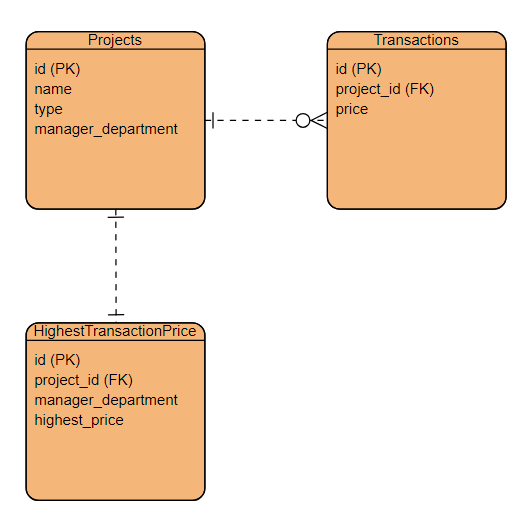
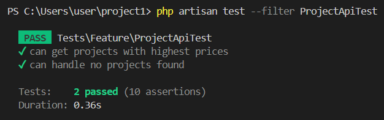
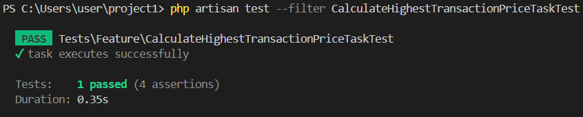

# Take Home API

## Introduction
This API provides functionality to retrieve projects with the highest prices based on certain criteria.
## Installation
1. 遵照https://laravel.tw/docs/5.3/installation 教學透過composer下載
2. run php artisan migrate to migrate the data base tables.

## Usage

endpoints
GET/projects: Retrieve projects with highest prices.

## Controller: ProjectController
The `ProjectController` 

Method: index
Description: 根據條件，獲取價格最高的項目。  
Request Method: GET  
Parameters: None   
Returns: JSON response containing project names and their highest prices.  

## Task: CalculateHighestTransactionPriceTask
此Task每天中午12點執行，找出建案類型為大樓且管理員部門為資料部的建案，並計算其最高交易單價存入。

## 資料表建立 Migration
你可以在以下路徑找到資料表建立的migration文件：

database\migrations\2024_04_10_050840_create_projects_table.php  
database\migrations\2024_04_10_051051_create_transactions_table.php  
database\migrations\2024_04_11_044437_create_highest_transaction_prices_table.php  
這些migration文件包含了專案資料表和交易資料表的建立指令，你可以透過執行php artisan migrate命令來執行這些migration，自動建立相應的資料表。  

## Testing

### Feature Test: ProjectApiTest
`ProjectApiTest` ensure the functionally of the `ProjectController`

#### Method: `test_can_get_projects_with_highest_prices`
Description: 測試API 驗證最高交易單價是否一致

#### Method: `test_can_handle_no_projects_found`
Description: 測試API 未找到符合的建案的情形，assert response為empty

### Feature Test: CalculateHighestTransactionPriceTaskTest
#### Method: `test_task_executes_successfully`
Description: 測試task 驗證最終表的最高交易單價與期望是否一致

## Author
Author: Jason Chou  
Email: jasonchou7906@gmail.com  

## License
This project is licensed under the MIT License.