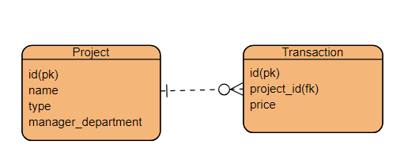

=======
# take_home_api
>>>>>>> ea9de753905fba579a8d05b7f74e429481d1f9b7
## Introduction
This API provides functionality to retrieve projects with the highest prices based on certain criteria.
## Installation
1. clone the respository
2. Run `composer install` to install dependencies.
3. Set up your database connection in the .env file.
4. run php artisan migrate to migrate the data base tables.

## Usage

endpoints
GET/projects: Retrieve projects with highest prices.

## Controller: ProjectController
The `ProjectController` 

Method: index
Description: Retrieves projects with the highest prices based on certain criteria.

Request Method: GET

Parameters: None

Returns: JSON response containing project names and their highest prices.

## 資料表建立 Migration
你可以在以下路徑找到資料表建立的migration文件：

database/migrations/2024_04_10_050840_create_projects_table.php
database/migrations/2024_04_10_051051_create_transactions_table.php
這些migration文件包含了專案資料表和交易資料表的建立指令，你可以透過執行php artisan migrate命令來執行這些migration，自動建立相應的資料表。

以下為ER model 

## Testing

### Feature Test: ProjectApiTest
`ProjectApiTest` ensure the functionally of the `ProjectController`

### Method: `test_can_get_projects_with_highest_prices`
Description: 測試API 從DB找出建案類型為大樓且管理員部門為資料部的所有建案 並從中return其中最高交易單價

### Method: `test_can_handle_no_projects_found`
Description: 測試API 從DB找出建案類型為大樓且管理員部門為資料部的建案 並未找到符合的建案的情形，assert response為empty

## Conclusion
此項API提供簡單且明確的方式，檢索所需的專案，並將最高交易單價的專案列出
